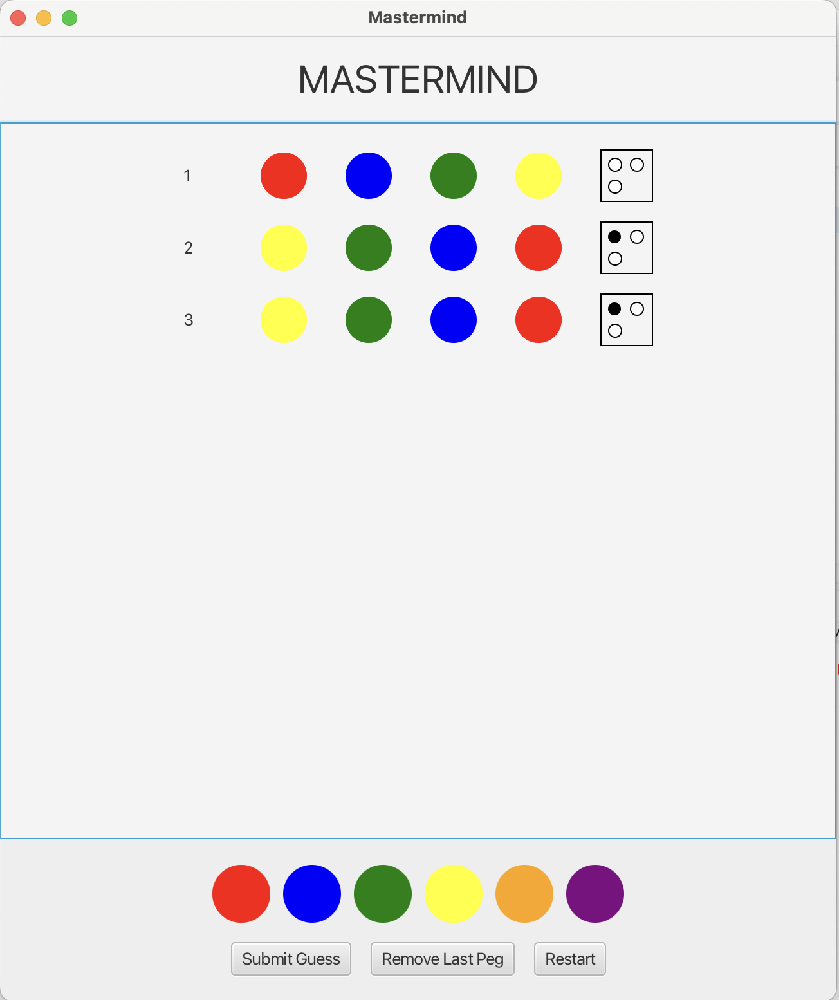

## Description
This project implements Mastermind. You can play the game by compiling it. When invoked with a command-line argument of “-text”, you will launch the text-oriented UI. When invoked with a command line argument of “-window”, you’ll launch the GUI view. The default will be the GUI view.

## How To Play
- The goal is to guess a generated sequence of 4 pegs of these available colors: red, blue, green, purple, yellow and orange
- You have 10 tries to guess the sequence of 4 pegs; repetitions can happen.
- For the GUI, the box with 4 circles indicates:
	- A black peg for each “Right Color, Right Place” peg.
	- A white peg for “Right Color, Wrong Place”.

### MVC - Implementation
1.	`Mastermind` – This is the main class. 
2.	`MastermindGUIView` – This is the JavaFX GUI as shown above
3.	`MastermindTextView` – This is the UI for both the GUI and the console output. 
4.	`MastermindController` – This class contains all of the game logic, and is shared by the textual and graphical UIs.
5.	`MastermindModel` – This class contains all of the game state and is also shared between the two front ends.
